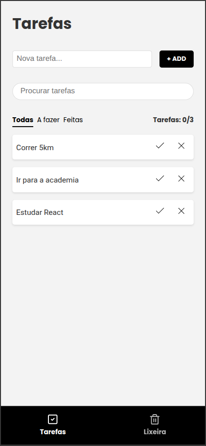
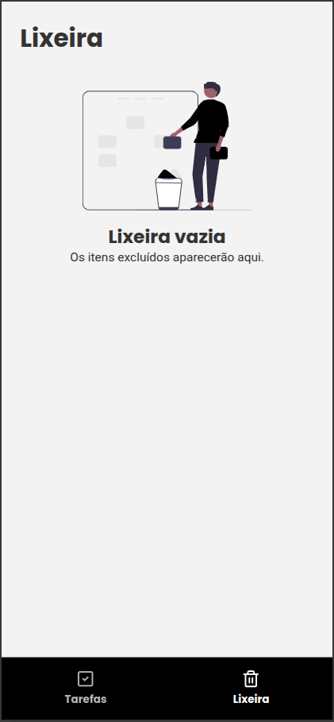

# Taski

<p align="center">
  
  
</p>

Este é um projeto de lista de tarefas (To-Do List) desenvolvido com React e Vite, utilizando arquitetura SPA (Single Page Application). A aplicação permite criar, editar, concluir, restaurar e excluir tarefas, além de oferecer filtros, busca e lixeira para gerenciamento completo das atividades.

O estado global é gerenciado com Context API combinada com custom hooks, garantindo uma estrutura organizada e escalável. As tarefas são persistidas no localStorage, permitindo manter os dados mesmo após recarregar a aplicação. A navegação é feita com React Router.

**Acesse**: https://taskiapp.vercel.app/

## Funcionalidades

- [x] Criar, editar e excluir tarefas
- [x] Marcar tarefas como concluídas
- [x] Sistema de busca
- [x] Filtros por status
- [x] Lixeira com restauração
- [x] Persistência de dados no localStorage

## Tecnologias

| Tecnologia   | Descrição                |
| ------------ | ------------------------ |
| TypeScript   | Linguagem de programação |
| React        | Biblioteca de UI         |
| React Router | Rotas na aplicação       |
| Context API  | Gerenciamento de estado  |
| Vite         | Ferramenta de Build      |
| HTML         | Estrutura de páginas     |
| CSS Modules  | Estilos modulares        |

## Requisitos

- **Node.js** 20.19 ou superior
- **npm** 10 ou superior.

## Como executar

1. Faça o clone do projeto.
2. Abra o terminal e navegue até a pasta do projeto.
3. Instale as dependências usando o comando:
   ```bash
   npm install
   ```
4. Inicie o servidor localmente com o comando:
   ```bash
   npm run dev
   ```

## Estrutura do projeto

```bash
taski/
├── docs/
├── public/
├── src/
│   ├── assets/
│   ├── components/
│   │   ├── Button/
│   │   └── ...
│   │
│   ├── pages/
│   │   ├── TodoPage/
│   │   └── ...
│   │
│   ├── constants/
│   ├── contexts/
│   ├── mocks/
│   ├── routes/
│   ├── styles/
│   ├── types/
│   ├── utils/
│   ├── App.tsx
│   ├── env.d.ts
│   └── main.tsx
│
├── .env.example
├── .gitignore
├── eslint.config.js
├── index.html
├── package-lock.json
├── package.json
├── README.md
├── tsconfig.json
├── vercel.json
└── vite.config.ts
```

## Encontrou algum problema?

Abra uma [issue](https://github.com/lucasrochabz/to-do-list/issues) com sua sugestão ou crítica.
